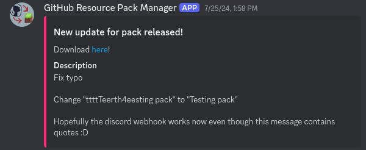

Want to have a notification in a discord server for when your pack is updated, so people can manually download it and use something like [Server Resourcepack Checker](https://modrinth.com/mod/server-resource-pack-checker) to join the server without needing to wait for Minecraft to reload resources?

Would you look at that, a fully customizable webhook system with even a preset for discord messages!? Perfect!

Ok let's talk about how it works...

## Explanation
You may have noticed the `webhookUrl` and `webhookBody` config options from earlier in the [Mod Configuration](../tutorials/configuration/mod-configuration.md) section.  
Those aren't for a webhook that the mod receives. Instead, they're for a webhook sent after a pack update is completed.

How does that work you ask?

Well the `webhookUrl` should be pretty self-explanatory, it's the url that the webhook will be sent to.  
For example a discord webhook such as [`https://discord.com/api/webhooks/1234567890123456789/eW91J3JlIG5vdCBzdGVhbGluZyBhIHRva2Vu_bm9wZQ==_eWVyJyBub3Q=`](https://www.youtube.com/watch?v=dQw4w9WgXcQ) or something custom like `https://api.service.com/NDI6IHRoZSBtZWFuaW5nIG9mIGxpZmUsIHRoZSB1bml2ZXJzZSwgYW5kIGV2ZXJ5dGhpbmc=`

The `webhookBody` may seem a bit complicated, but I swear it's not. It's just a relative path from the config directory to a webhook body file. Got all that?  
Have you noticed the `basic_webhook.json` file and `discord` directory next to the main config file? Those are webhook body files!  
Take a look at the `discord/basic_message.json` file:
```json
{
	"username": "GitHub Resource Pack Manager",
	"avatar_url": "https://github.com/OffsetMods538/Github-Resourcepack-Manager/blob/master/src/main/resources/assets/github-resourcepack-manager/icon.png?raw=true",
	"content": "New update for pack released!\nDescription: {shortDescription}\nDownload [here]({downloadUrl})"
}
```
This exact json will be sent to the webhook url provided in the main config, just with the placeholders replaced.  
That is the great part of the webhook system: you can adapt it to send data to literally *anything* by creating a new body file and customizing it to your needs!

## Usage
Let's actually set up messages like this on our discord server:


### Creating webhook
Right-click on the Discord channel you want to create a webhook for and select `Edit Channel`.  
Next open the `Integrations` tab and press the `Create Webhook` button.  
Now click on the webhook that Discord created for you, and then click `Copy Webhook URL`. You do not need to change any settings on this page.

### Configuring the mod
Open the config file of the mod and set the `webhookUrl` to your discord webhook. Make sure it's in quotes.  
Example: `"https://discord.com/api/webhooks/1234567890123456789/eW91J3JlIG5vdCBzdGVhbGluZyBhIHRva2Vu_bm9wZQ==_eWVyJyBub3Q="`

Then set the `webhookBody` to `"discord/embed_message.json"` (or `"discord/basic_message.json` if you're feeling basic today). Make sure this is also in quotes.

Last step is to modify the json file you chose. This is optional, but you probably don't want the name of the mod and the ugly logo I made for it as your bot.

### Testing
Finally, you can try it out!  
All you need to do is start up your server and try committing something to your repository. Everything should work!

###### If not then yeah idk come scream at me on my discord server, the invite of which you can find [here](https://discord.offsetmonkey538.top)