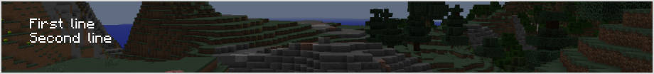
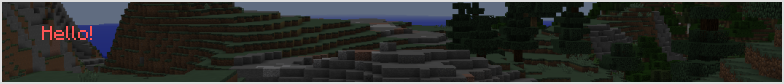
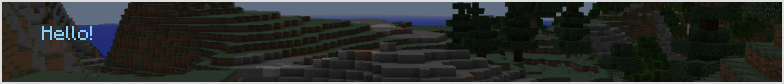
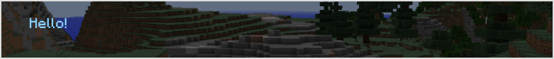
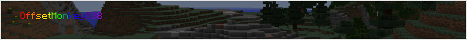
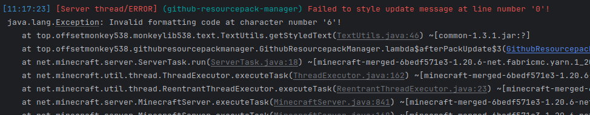
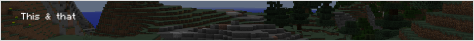
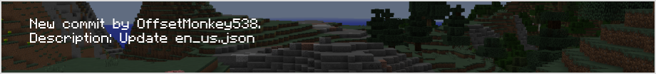

## Text formatting

The mod allows you to format your text, this means coloring it using vanilla color codes or hex colors and making it *italic*, **bold**, ***both***, etc.

### New line

You can split the message into multiple lines by adding `\n` where you want a new line to begin.  
For example `"First line\nSecond line"` is rendered like this:  

### Formatting codes

You've probably heard of or even used Minecraft formatting codes before. You can use them here too!  
All you need to do is use the `&` (and) symbol and then a formatting character after it. 

You can find all the formatting codes available in Minecraft [here](https://minecraft.wiki/w/Formatting_codes#Color_codes).

For example `"&cHello!"` would be rendered like this:  

And `"&l&cHello!"` would be rendered like this:  

### Hex colors

If those 16 colors aren't enough for you, then luckily you can also use hex colors!  
All you need to do is use the `&` (and) symbol and then the hex code after it (including the `#`).

You can use the [Google color picker](https://www.google.com/search?q=hex+color+picker) for picking hex colors.

For example `"&#87CEFAHello!"` would be rendered like this:  

You can also combine formatting codes with hex colors.  
For example `"&l&#87CEFAHello!` would be rendered like this:  

For gradients, you can use [this site](https://www.birdflop.com/resources/rgb/).  
For example (generated using that site) `"&#FF0000O&#FF3600f&#FF6D00f&#FFA400s&#FFDA00e&#DBFF00t&#6DFF00M&#00FF00o&#00926Dn&#0024DBk&#1500DBe&#3600A6y&#55008E5&#7500B03&#9400D38"` would be rendered like this:  

## Character escaping

If you want to use an `&` (and) character *without* it doing any formatting, you can add two `\` (back-slashes) before it.  
For example `"This & that"` is rendered like this:  

But `"This \\& that"` is rendered like this:  

## Placeholders

If you want to include information about the commit that was pushed, you can use placeholders.  
Here's a list:

| Placeholder              | Value                                                   |
|--------------------------|---------------------------------------------------------|
| {ref}                    | The branch that was committed to.                       |
| {lastCommitHash}         | The hash of the last commit before this one.            |
| {newCommitHash}          | The hash of the new commit.                             |
| {repositoryName}         | The name of the repository.                             |
| {repositoryFullName}     | The full name of the repository.                        |
| {repositoryUrl}          | The url pointing to the repository.                     |
| {repositoryVisibility}   | The visibility of the repository (public or private).   |
| {pusherName}             | The username of the person who pushed the commit.       |
| {headCommitMessage}      | The message of the latest commit.                       |

Here's an example of using one: `"New commit by {pusherName}.\nDescription: {headCommitMessage}"`:  

###### * btw these screenshots are actually from [minecraft.tools](https://minecraft.tools/en/json_text.php) and not Minecraft lol.
