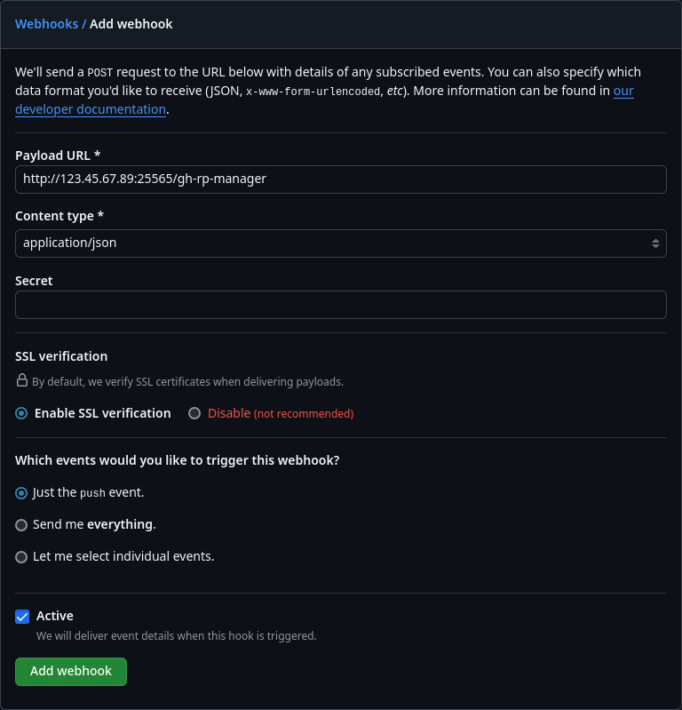

The mod listens for a webhook (POST request) sent by GitHub to know when the repository is updated.  
The last thing you need to do now, is adding the webhook.

You need to go to your repository page on GitHub and open the `Settings` tab.  
On the sidebar you need to find and click on `Webhooks`.  
Here click on the `Add webhook` button.

Now that you're on the webhook creation page, you'll need to fill in some values.  
For `Payload URL` put `http://[YOUR_SERVER_IP]:[YOUR_SERVER_PORT]/gh-rp-manager`.  
For example if your server ip is `123.45.67.89`, the port `25565`, the url would be `http://123.45.67.89:25565/gh-rp-manager`.

Then set `Content type` to `application/json`.

This is what it should look like:

Now you can press `Add webhook` button and you should be done!
