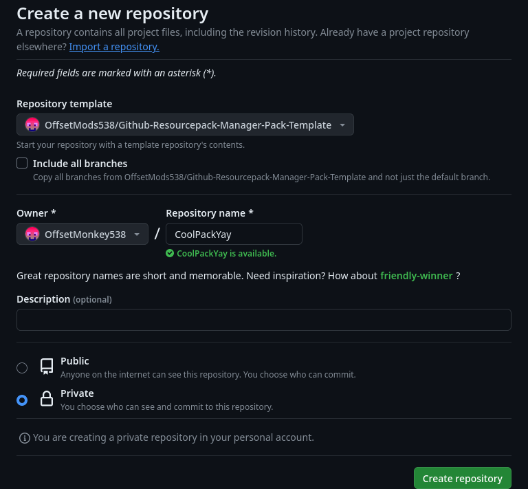

You'll need a GitHub repository to host the pack files. *duh*

There are two ways the mod can operate:

- **Single pack mode**: This is the basic option. Here the root of the repository is also the root of the resource pack. The `pack.mcmeta` file will be right in the root of the repo along with your `assets` folder.

- **Multi pack mode** (*what I recommend*): This is a little more advanced, but it's still easy to set up thanks to a template repo I made. Here you can have multiple resource packs! The root of your repository should include a `packs` folder which can contain `.zip` files and folders which contain the content of the packs. They do need to be prefixed with a priority. (which you can read more about [here](../../reference/priority.md))

## Multi pack from template
I've made a nice template repository, so you can easily get started with your packs!  
So, what you'll need to do is visit the template [here](https://github.com/OffsetMods538/Github-Resourcepack-Manager-Pack-Template/).  
You should see a greed button that says `Use this template`. Click on it and select `Create a new repository`.  
This should bring you to the repository creation page. Here you can give your repository a name and, if you want, you can make it private as well.

Once you're done, just press the `Create repository` button.

We will come back to the repository *after* configuring the mod.