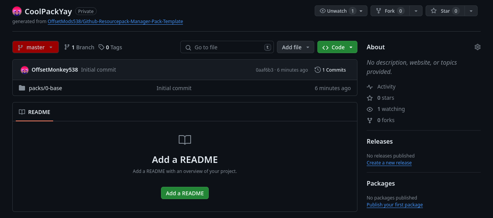
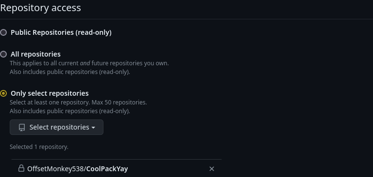

Once you have the mod and its dependencies installed, you can launch the server once. It should crash telling you to `Fill in the config file`.  
Let's do that!

It should have generated the config file at `serverLocation/config/github-resourcepack-manager/github-resourcepack-manager.json` and it should look something like this:
```json
{
	// !!!!Please check the wiki for how to set up the mod. It is linked on both the Modrinth and GitHub pages!!!!
	"packUpdateMessage": "Server resourcepack has been updated!\nPlease click {packUpdateCommand} to get the most up to date pack.",
	"packUpdateMessageHoverMessage": "{longDescription}",
	// The public ip of your server (123.45.67.89 or play.coolserver.net)
	"serverPublicIp": null,
	// Should be "[YOUR BRANCH NAME HERE]"
	"branch": "master",
	"repoUrl": null,
	// Where the mod will search for resource packs in the cloned repository
	"resourcePackRoot": "",
	"isRepoPrivate": false,
	"githubUsername": null,
	// PLEASE DON'T SHARE THIS WITH ANYONE EVER
	"githubToken": null,
	"webhookUrl": null,
	"webhookBody": null,
	// !!!!! DO NOT MODIFY THIS VALUE !!!!
	"!!!version": 1
}
```

## Value types
If you have a basic understanding of json values, you can skip this section and go straight to [options](#options).

In the next section, I will be specifying which type an option is, but first I'll explain the different types:

### Integer
An integer is a number without a decimal point.  

For example `1234` **is** an integer, but `12.34` **is not**.

### Boolean
A boolean can be either `true` or `false`.

### String
A string represents text.  
The text has to be surrounded by double quotes (`"`).

Example of valid string:
```json
"githubUrl": "https://github.com/OffsetMonkey538/CoolPack"
```

Example of invalid string:
```json
"githubUrl": https://github.com/OffsetMonkey538/CoolPack
```

A string can also be `null`.  
Null basically means that the value doesn't exist.  
In most cases using `null` for a string will result in an unexpected error, but I will mark values that can be null without a crash.

## Options
### packUpdateMessage
!!! info ""
    Type: `String`  
    Default Value: `"Server resourcepack has been updated!\nPlease rejoin the server to get the most up to date pack."`  
    May be null: `no`
This message will be displayed after an update to the resource pack.  
It can contain color codes (including hex), new lines and information about the commit, which you can read more about [here](../../reference/update-message.md).

### packUpdateMessageHoverMessage
!!! info ""
    Type: `String`  
    Default Value: `"{longDescription}"`  
    May be null: `yes`
This message will be displayed when a player hovers over the pack update message in chat.  
It may *not* contain color codes, but can contain new lines and information about the commit, which you can read more about [here](../../reference/update-message.md).

### serverPublicIp
!!! info ""
    Type: `String`  
    Default Value: `null`  
    May be null: `no`
This is your servers public ip. This is sent to the clients, so they know where to download the pack from.  
For example: `"1283.45.67.89""` or `"play.offsetmonkey538.top"`

### branch
!!! info ""
    Type: `String`  
    Default Value: `"master"`  
    May be null: `no`
This is the git branch that the mod will download the resource pack from.  
Here's an image showing (in red) where the name of your branch is located:  


### repoUrl
!!! info ""
    Type: `String`  
    Default Value: `null`  
    May be null: `no`
This is the url to your GitHub repository.  
For example: `"https://github.com/OffsetMonkey538/CoolPackYay"`

### resourcePackRoot
!!! info ""
    Type: `String`  
    Default Value: `""`  
    May be null: `no`
This is where in the repo the mod will search for the pack.mcmeta or packs directory.  
Only change if the resource pack isn't stored in the root of the repository.

### isRepoPrivate
!!! info ""
    Type: `Boolean`  
    Default Value: `false`  
    May be null: `no`
This tells the mod that your GitHub repository is private and that it needs to provide credentials to download it.
If your GitHub repository is private, you need to set this to `true`.

### githubUsername
!!! info ""
    Type: `String`  
    Default Value: `null`  
    May be null: `yes`
The username the mod provides for credentials when downloading a private pack.  
If your GitHub repository is private, you need to set this to your GitHub username.

### githubToken
!!! info ""
    Type: `String`  
    Default Value: `null`  
    May be null: `yes`
The token the mod provides for credentials when downloading a private pack.  
If your GitHub repository is private, you'll need to generate a token and paste it here.  
See [here](#generating-the-token-for-private-repositories) for how to generate a token. 

### webhookUrl
!!! info ""
    Type: `String`  
    Default Value: `null`  
    May be null: `yes`
Webhook triggered after a pack update is finished.  
For example sending a message in Discord.  
More info [here](../../reference/discord-webhook.md).

### webhookBody
!!! info ""
    Type: `String`  
    Default Value: `null`  
    May be null: `yes`
Webhook triggered after a pack update is finished.  
For example sending a message in Discord.  
More info [here](../../reference/discord-webhook.md).

#### Generating the token for private repositories
To generate a token, go [here](https://github.com/settings/tokens?type=beta) and click the `Generate new token` button.  
This should bring you to the token generation page. Here you'll need to give it a name and, if you want, modify the expiration date and description.

After that, scroll down to `Repository access`.  
Here you'll want to select `Only select repositories`, then click on `Select repositories` and finally search for your private resource pack repository.


Now scroll down to `Permissions`.  
Here you need to click on `Repository permissions`, then find `Contents`, click on the drop-down next to it that says `Access: No access` and select `Read-only`.  

This will give the token just enough permissions to download the repo contents, but (hopefully) not enough to do anything bad with.  
That being said, you should still *never* share any access tokens with *anyone*.

After that, you can scroll down and press the green `Generate token` button.  
On the next page, copy the token and paste it into the config file.

## Done ;D

And now you can start your server and configure your GitHub repository!
